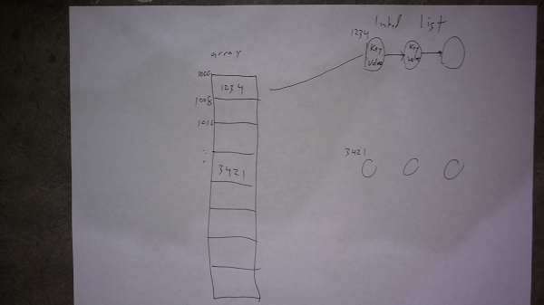

# Graph

An graph is non-linear data structure that is composed of vertices (data items) and edges (connections between nodes).

# In Memory

In memory, an graph looks like this:



A graph can be implemented as either an adjacency matrix, for dense graphs, or as an adjacency list for sparse graphs. In memory an adjacency matrix looks a lot like a hast table. there is an array, which holds the vertices, and associated with each vertex is a list of edges in a linked list.

# Operations

An array supports the following operations:

* **addVertex/insert**: add a node to the graph.
  * O(1), constant time. Append a new entry to the set of vertices. O(1) just like insert to a hash table.
* **addEdge/insert**: add an edge to the graph. An edge is a connection between two nodes
  * O(1), constant time. retrieve the two nodes from the set of vertices (O(1)). Append the edeg to both of the nodes adjancey lists also O(1).
* **removeVertex/delete**: remove the vertex with a specified value from a graph, along with it's edges.
  * O(|V|), linear time wrt number of edges. Retrive adjacency list for the vertex. For each edge in the adjacency list retrive the adjacency list for the vertex at the other end of the egse and remove this vertex from the list. The number of edges can be as many as |V|-1, which makes this operation O(|V|)
* **removeEdge/delete**: remove an edge from the graph.
  * O(|V|), linear time wrt number of vertices. For each vertex retrieve adjacency list and loop over the list to find and remove the edge. The number of edges in each of the two adjacency lists can be as many as |V|-1, which makes this operation O(|V|)
* **search**: find a value stored in a node of the graph. Return boolean True if found, False otherwise.
  * O(|V|+|E|), linear time. Assuming we don't have a specialized graph type like a bst, we will have to traverse through the graph until we find the value. Both breadth first and depth first traversals are O(|V|+|E|).
* **hasEdge**: check if an edge exists between two specified nodes. Return boolean True if found, False otherwise..
  * O(|V|+|E|), linear time. Search for vertex 1 O(|V|+|E|). Then check its adjacency list and remove the edge.


# Use Cases

An graph is useful for distribution or networking type applications. An example is finding the shortest path when you need vist multiple cities, connecetd by svereal routes with varying distances. Another example is TCP/IP which determines how data on the internet is routed between the source and the destinations through a number of intermediate points.

It is not as good as almost any other structure when there are not multiple possible paths to get between nodes.

# Example

```
g = Graph()
g.addVertex('aaa')          # add a node with value 'aaa' to the graph
g.addEdge('aaa, 'bbb')      # add an edge between vertices 'aaa' and 'bbb
g.removeVertex('aaa')       # remove the vertex with value 'aaa'
g.removeEdge('aaa, 'bbb')   # remove the edge between the specified vertices
g.search('ccc')             # return True if a vertix with value 'ccc exists, False otherwise
g.hasEdge('aaa','ccc')      # return True if there is an edge between the specified vertices, False otherwise

```

(c) 2018 STEVE FINCH. All rights reserved.
