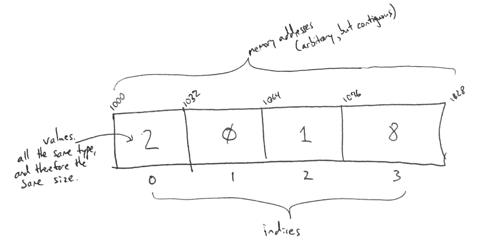

# Hash Table

A hash table is a non-linear data structure that allows efficient search and retrieval of data items based on lookup keys (like a dictionary of words lets you look up definitions).

# In Memory

In memory, an array looks like this:



\[description of diagram\]

# Operations

An array supports the following operations:

* **insert**: obtain a value stored in the structure at a specific indexed position in the array.
  * O(1), constant time. An array variable really just records the base address of the array, so we know the exact memory address of the beginning of the array. We also know the data type of the elements in the array, and therefore the size of each element. Given the index of an element we wish to read, we can calculate the address of that element in *one step*: base address + sizeof(datatype) * index. Since we can calculate this in one step for all values in the array, this is an O(1) constant time operation.
* **delete**: obtain a value stored in the structure at a specific indexed position in the array.
  * O(1), constant time. An array variable really just records the base address of the array, so we know the exact memory address of the beginning of the array. We also know the data type of the elements in the array, and therefore the size of each element. Given the index of an element we wish to read, we can calculate the address of that element in *one step*: base address + sizeof(datatype) * index. Since we can calculate this in one step for all values in the array, this is an O(1) constant time operation.
* **search**: obtain a value stored in the structure at a specific indexed position in the array.
  * O(1), constant time. An array variable really just records the base address of the array, so we know the exact memory address of the beginning of the array. We also know the data type of the elements in the array, and therefore the size of each element. Given the index of an element we wish to read, we can calculate the address of that element in *one step*: base address + sizeof(datatype) * index. Since we can calculate this in one step for all values in the array, this is an O(1) constant time operation.    


# Use Cases

An array is useful \[when\] \[why\].

It is not as good as \[what] \[why].

# Example

```
h = HastTable()
h.insert('abc', 14)   # insert an entry with key 'abc' and value 14
h.delete('def')       # delete theentry with key 'def'
h.search('ghi')       # return the value that corresponds to key 'ghi'
```

(c) 2018 STEVE FINCH. All rights reserved.
