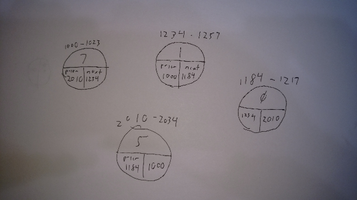

# Linked List

A linked list is linear data structure composed of data items called nodes which can be traversed in order in one direction (for a singly linked list) or in both directions (for a doubly linked list)..

# In Memory

In memory, alinked list looks like this:



\[description of diagram\]

# Operations

A linked list supports the following operations:

* **access/read**: obtain a value stored in the structure at a specific indexed position in the array.
  * O(n), linear time. To access the value at a given position iterate through the list to the desired index. Worst case will be the length of the list, Average case will be halfway through the list. This makes the complexity O(n)
* **append**: add a value to the end of the list.
  * O(1), constant time. Assuming either a pointer to last of doubly linked with first's prior pointing to last
* **insert**: add a value to the list after the specified index.
  * O(n) or O(1), linear or constant time. Iterate through the list until the desired index. n/2 steps on average so O(n). The actual insert is O(1) because you only have to reset the prior/next pointers on the nodes before and after the insert.
* **delete**: remove the value at at a specific indexed position.
  * O(n) or O(1), linear or constant time. Same as insert.
* **find**: search for a specified value and return its index.
  * O(n), linear time. Assuming an unordered list iterate through the list until the desired value is found. On average n/2 steps so O(n)

# Use Cases

An array is useful when effeicnt insertions or deletions into the middle of the list are needed. An example is a linked list used to store hash table collision items. A linked list is also useful when the number of items is not known, or can vary widely. In these cases an array could often need to change size with the resulting overhead of the create larger array/copy dynamic array resizing.

It is not as good when items can be addressed using idices (array) or keys (hash table), or need to be added to the beginning or end (stacks or queues, although stacks and queus can both be implemented using a linked list.)

# Example

```
l = LinkedList()
l.access(4)           # return the value of the 4th node in the list
l.append('rat')       # add a node with value 'rat' to the end of the list
l.insert(3,'cat')     # add a node with value 'cat' to the list after the 3rd node
l.delete(5)           # delete the 5th node from the list
l.find('bird')        # return the index of the node with value 'bird'
```

(c) 2018 Steve Finch. All rights reserved.
